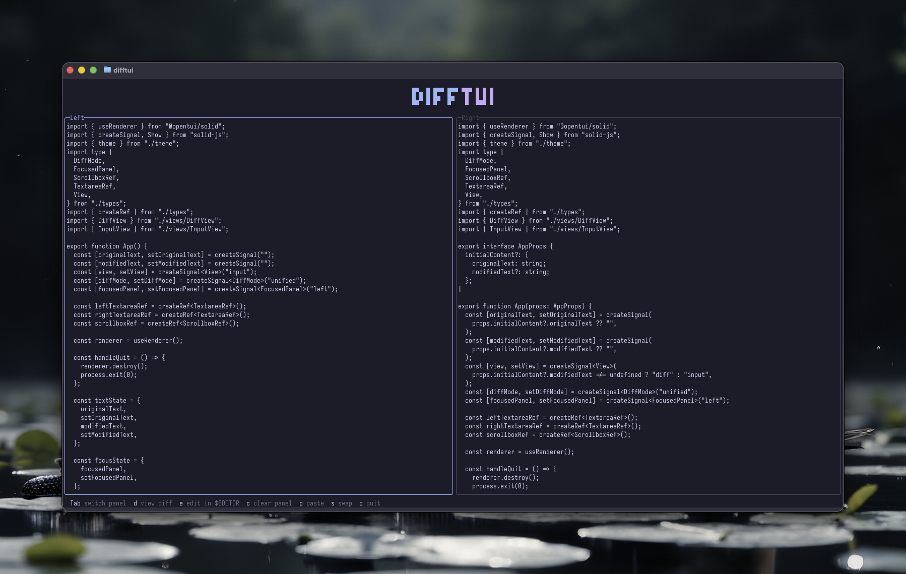
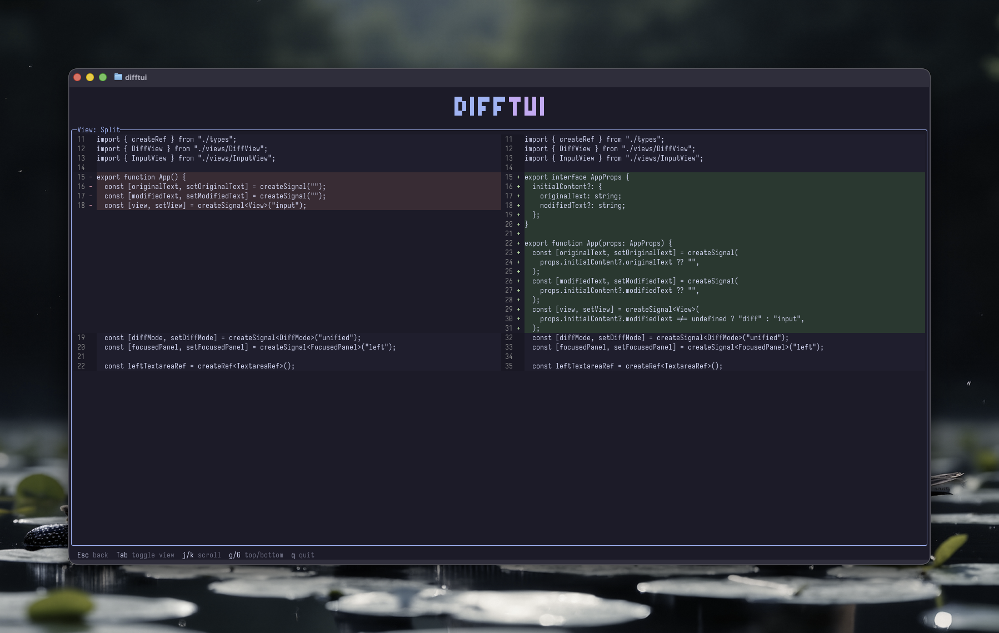

# difftui

A TUI for comparing and diffing text.




## Features

- Side-by-side text input panels
- Unified and split diff views
- Syntax highlighted diff output
- Clipboard paste support
- Vim-style navigation

## Installation

### With Homebrew

```bash
brew install mholtzscher/tap/difftui
```

### With Nix

```bash
nix run github:mholtzscher/difftui
```

Or add to your flake:

```nix
{
  inputs.difftui.url = "github:mholtzscher/difftui";
}
```

### From source

Requires [Bun](https://bun.sh):

```bash
git clone https://github.com/mholtzscher/difftui
cd difftui
bun install
bun run dev
```

## Usage

```bash
difftui --help
```

## Keybindings

### Input view

| Key   | Action           |
| ----- | ---------------- |
| `Tab` | Switch panel     |
| `d`   | View diff        |
| `e`   | Edit in $EDITOR  |
| `c`   | Clear panel      |
| `p`   | Paste            |
| `s`   | Swap panels      |
| `q`   | Quit             |

### Diff view

| Key   | Action       |
| ----- | ------------ |
| `Esc` | Back         |
| `Tab` | Toggle view  |
| `j/k` | Scroll       |
| `g/G` | Top/bottom   |
| `q`   | Quit         |

## License

MIT
